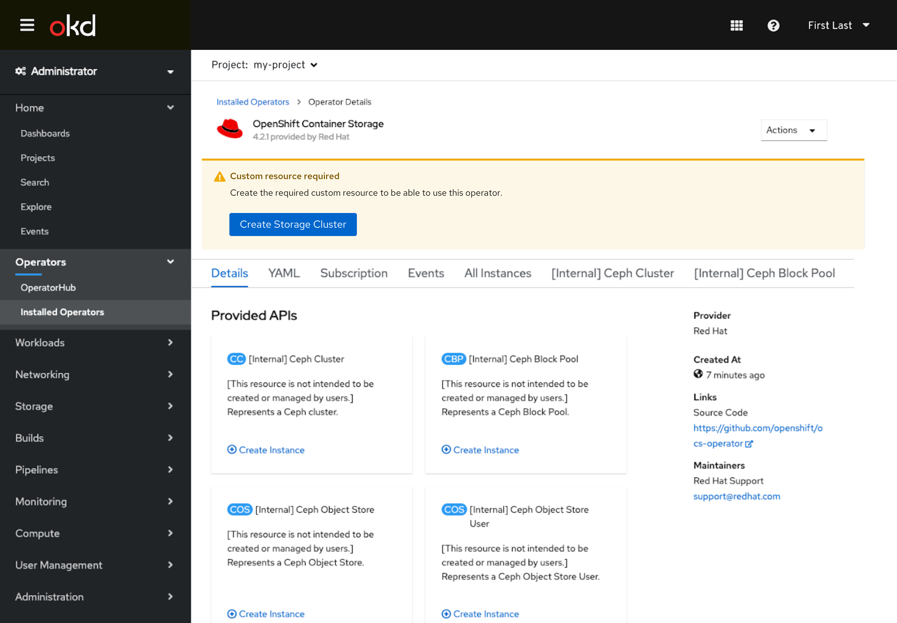
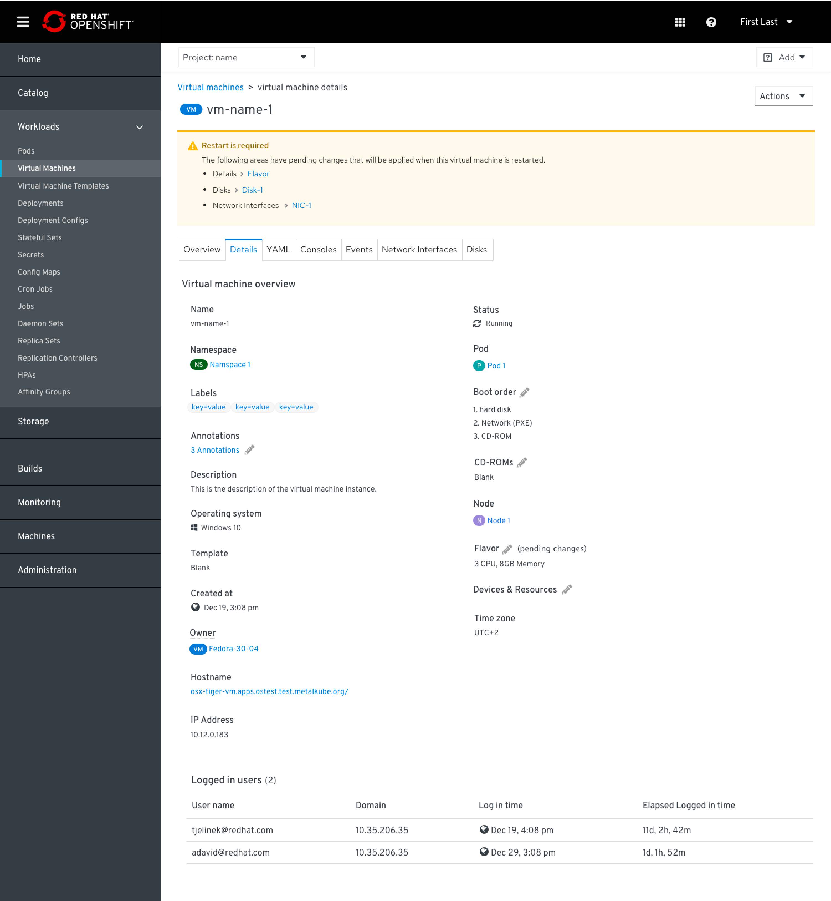
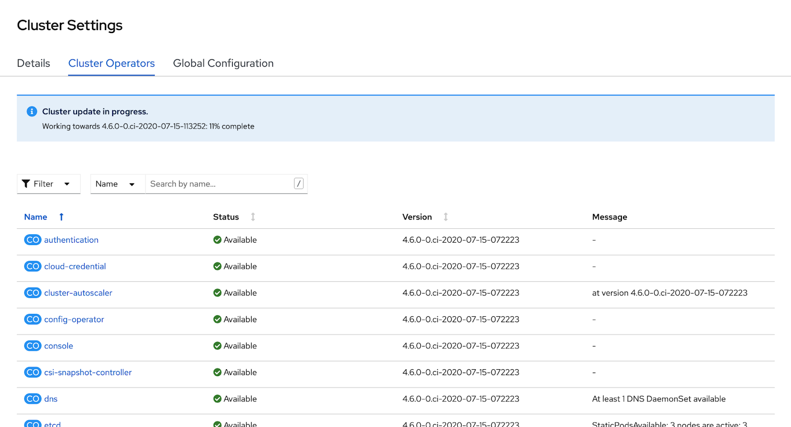
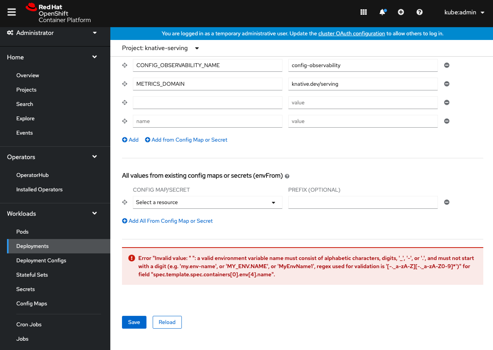
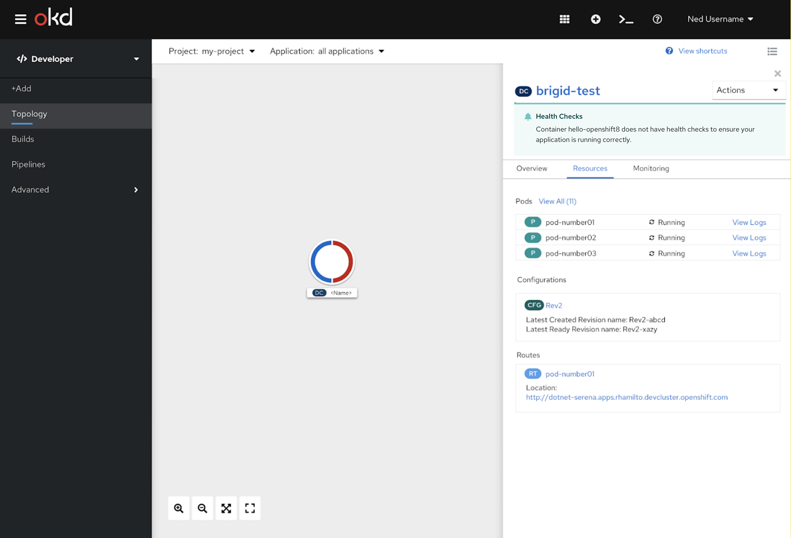
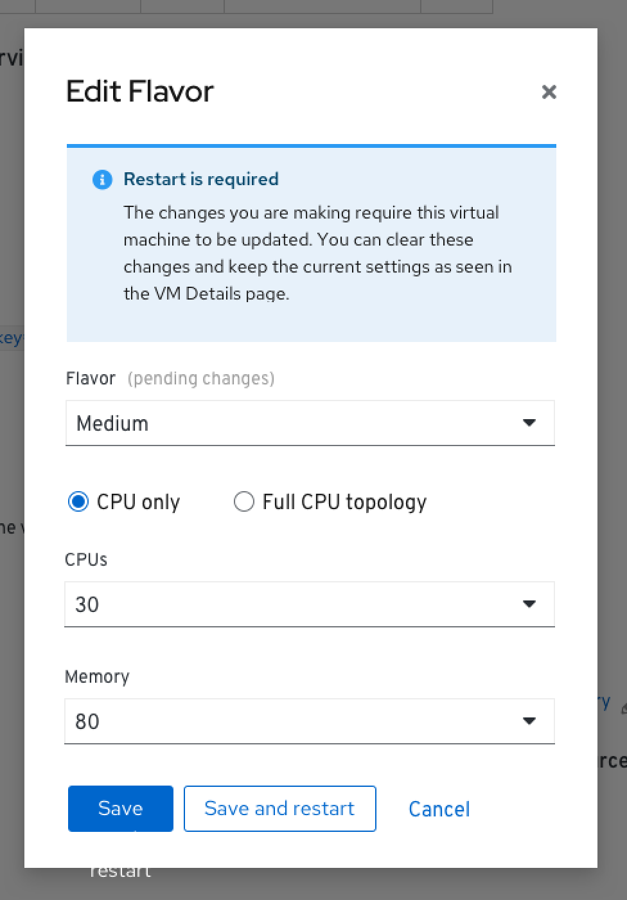
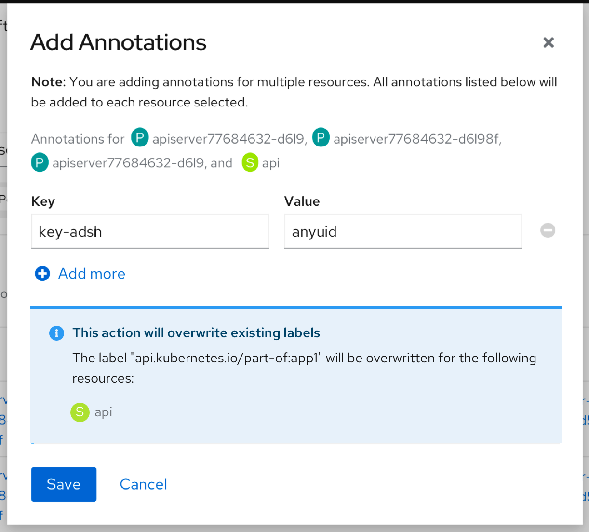
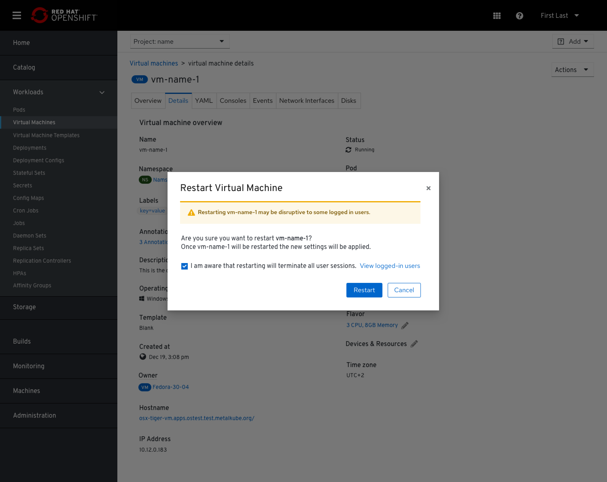

# Alerting

## Inline Alerts
Inline Alerts can be used throughout the console to notify users in context that something is happening, happened, or needs their attention.

### Inline Alerts in Details Views

#### Above navigation tabs
Inline alerts can appear above the navigation tabs when there is an important piece of information that applies to the entire resource, and the user should be made aware of regardless what tab they are looking at.

- Generally, these should be warning or error level alerts, and not just informational or neutral.
- The alert should appear immediately above the navigation tabs.

- If multiple alerts are present in different tabs, the list of tabs with alerts can appear as a bulleted list of links to allow the user to easily navigate to those areas. 

#### Below navigation tabs
Inline alerts can appear at the top of an individual navigation tab when there is a particular piece of information that applies to that one tab, and is not severe enough to surface at all times in the resource.

- Generally, these should be info or neutral alerts.
- A warning or error level alert can be surfaced only in the tab it relates to if it is in response to a users action inside the tab.
- The alert should appear immediately below the tabs.

#### Bottom of page
For actions taken inside of a page, resulting errors and success messages in the form of an inline alert are shown at the bottom of the page, near the action buttons that were used to initiate the action.

#### In Side Panel
When a Details View appears as a Side Panel, the location of the inline alert should match how it appears as a standalone Details View.

### Inline Alerts in Modals

#### At top of modal
If a modal is loaded with an inline alert already in place, the alert would show at that top of the modal.

#### At bottom of modal
If the user can take an action that causes an inline alert to appear, it should appear near the control they modified or more generally at the bottom of the modal, above the buttons.

## Alerting with Modals
Some actions benefit from additional confirmation or alert that something is going to happen, and modals can be used for this purpose. Many [delete](http://openshift.github.io/openshift-origin-design/conventions/documentation/delete.html) cases use confirmation modals.

### Confirmation Modal

- A warning icon can be included to the left of the title.
- Buttons appear on the right side of the modal until the console fully transitions to PatternFly 4.