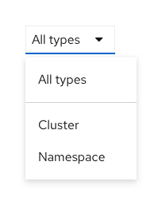
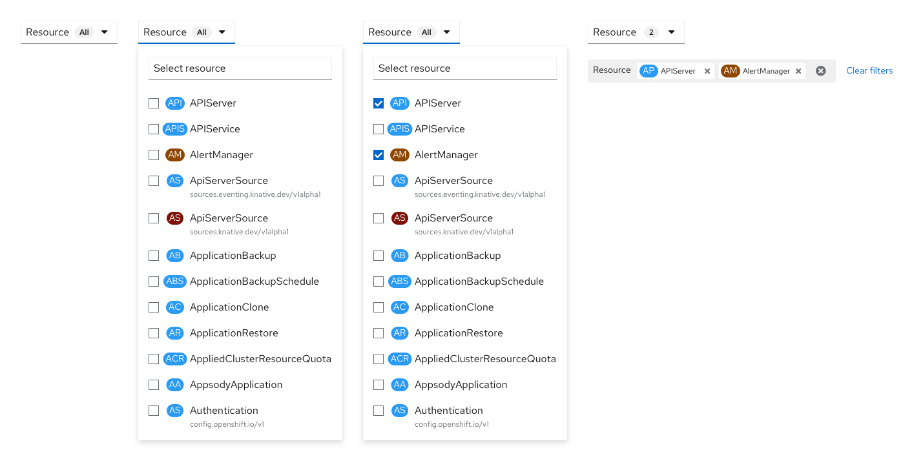

# Toolbars

These conventions are used as toolbar guidelines across the console. They reference and build off of the [PatternFly toolbar design guidelines](https://www.patternfly.org/v4/design-guidelines/usage-and-behavior/toolbar).

## Format

### Order

This describes the order in which elements should appear in the toolbar. 

1. Bulk selector
2. Filters
    + Multi select filter(s)
    + Single select filter(s)
    + Attribute-value filter(s)
    + Search filter(s)
3. Action button(s)
4. Overflow menu/column management
5. Item count

---

## Filters

### Single select filters

A divider in the menu between “All X” and all other menu items provides a clear distinction between items in a single select filter.

### Multi select filters

The default filter title in a multi select filter is a singular noun, next to which appears an “All” badge. There is no “All X” menu item option. For this example, this means that the menu would not include an “All resources” menu item as a first filterable option. Filter chips only open up below when the user selects one or more items. The filter chip group category title should match the filter title. 

### Name/label filters

The name/label filter should not include a “filter” icon. Both name and label filters open up filter chip groups below when selected. The name search is a dynamic filter which updates the filter chip as users type. The label search includes a typeahead, although the current Search page is an exception.

### Search filters

In search filters, the placeholder text should read “Filter by X…”

### Filter chips 

Consult the [PatternFly basic filter chip and complex filter chip](https://www.patternfly.org/v4/design-guidelines/usage-and-behavior/filters#filter-chips) documentation.

---

## Content

### Capitalization

The toolbar uses sentence case capitalization everywhere. See our [Capitalization](http://openshift.github.io/openshift-origin-design/conventions/documentation/capitalization.html) convention for exceptions and more information. 

### Item count

The item count can appear as the last item in the toolbar and displays the number of items of a table or list view below it. When a filter is applied, the item count will be updated to represent the filtered subset of items. The item count should be the right-most element. 

### Special toolbars

There are a number of pages that have custom toolbars, for example the Pod logs toolbar.

