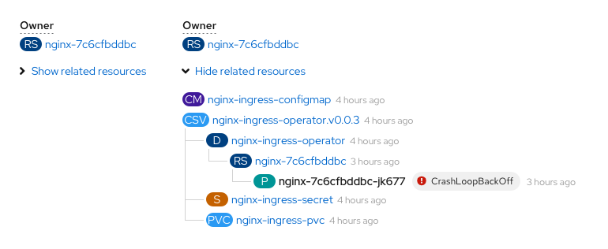
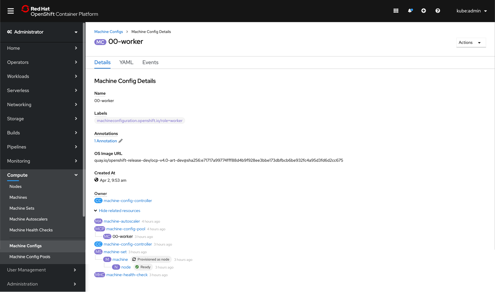

# Resource relationships

On resource details pages, add an expandable tree to show related resources. For some resources this will be under the `Owner` field.

Only show resources that go up the tree from the resource whose details the user is viewing. The tree will only show on a subset of resources’ details pages including:
* Deployments
* Replica Sets
* Stateful Sets
* Pods
* Machine Sets
* Machines
* Nodes

CSVs can be a part of the tree, but the tree will not be shown on the CSV's details page.

## Design

In an expandable component, show the owner tree with each child resource indented below its owner and connected with a grey line. Where applicable, show the resource's status badge next to the resource name as well as the date created. The resource whose Details page the user is on should not be a link and should be bolded.

**Example**  

Note that some resources in the tree may not be owned by the same top-level resource, in this case the CSV. The Config Map doesn't have an owner but is still related to these set of resources and thus is shown at the top. The Secret and PVC are owned by the same top-level resource, the CSV, and appear connected to the tree with grey lines.

**Example in context**

