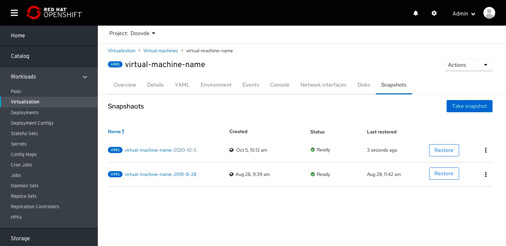
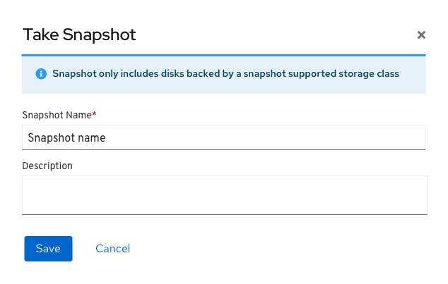

# Snapshots - updates

## Adding a ‘Last restored’ column to the list view

We'll add a ‘Last restored’ column to the snapshots list
that will show which snapshot was restored most recently, so the latest snapshot would be at the top of the list and indicate the time when it was last restored from.

## Restore VM from a snapshot

After the user clicked to ‘Restore’ VM from a snapshot we will show in the status column that the VM is currently being restored from this snapshot.
Restore can be done either from the kebab menu or from the secondary button at each row.

### Restoring popover

## Restore completed

## Restore failed

In case the Restore failed the users can either go to the snapshot details page (by clicking the snapshot name) to see the inline warning alert and continue the investigation from the link.

Or click the ‘Try again’ and create a new one and continue the restore procedure.

## Adding a description

 We will add the option for the user to add a description to the Snapshot modal so they will remember what this snapshot contains when they will restore from it. 
 The description for the VM Snapshot will be added to the Details Page as well.

And also on the details page

## A Restore action is added to the Actions menu

